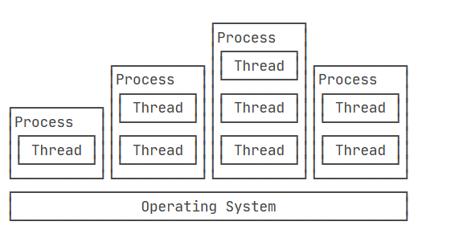

[toc]

# Java笔记17-多线程

## 多线程介绍

从CPU的角度上看,CPU执行代码都是一条一条顺序执行的，操作系统执行多个任务实际上就是让CPU轮流交替执行多个任务。

例如，假设我们有语文、数学、英语3门作业要做。我们把这3门作业看成是3个任务，可以让操作系统把1秒分成3份，即333毫秒。然后让cpu在1秒内做333毫秒语文作业，再做333毫秒数学作业，再做333毫秒英语作业。这样轮流做下去，在某些人眼里，看上去就像在1秒内同时在做3门作业一样。

类似的，操作系统可以轮流让CPU交替执行多个任务(即操作系统分配CPU时间片给每个线程)，例如，让浏览器执行0.001秒，让QQ执行0.001秒，再让音乐播放器执行0.001秒，在人看来，CPU就是在同时执行多个任务。

## 什么是程序，进程，线程？

程序：为完成特定任务，用某种语言编写的一组指令集合，即一段静态的代码。

进程：在计算机中，我们把正在运行的一个程序称为一个进程，例如浏览器就是一个进程，视频播放器是另一个进程，音乐播放器和Word都是进程。

线程：指进程中的一个子任务操作。例如迅雷是一个进程，在迅雷中下载一个文件，这个下载就是一个线程。同时下载多个文件，就是多个下载线程在迅雷进程中执行。

> 进程与线程的关系
- 一个进程可以包含多个线程，但至少有一个线程在进程中。否则进程无法运行。
- 在一个进程中可以同时运行多个不同的线程，它们可以并发执行进程中的各个任务。



> 注意
- 单CPU中进程只能是交替执行，多CPU中进程可以并行也可以交替执行。
- 单CPU单核中线程只能交替执行，单CPU多核中线程可以并行也可以交替执行。
- 无论是交替执行还是并行，在使用者来看，看到的是多进程，多线程。

## 创建多线程

Java语言内置了多线程支持：一个Java程序实际上是一个JVM进程，JVM进程用一个主线程来执行main()方法，在main()方法内部，我们又可以启动多个线程。此外，JVM还有负责垃圾回收的其他工作线程等。

Java 提供了2种创建多线程的方法：
方式①：通过继承 Thread 类本身,重写该类的run方法。
方式②：通过实现 Runnable 接口

记忆口诀：
1. run()方法：包含线程运行时所执行的代码。start()方法：用于启动线程。
1. 无论是继承Thread类还是实现Runnable接口。新的类都是先重写run()方法，后执行start()方法。
2. 继承Thread类后，子类实例化对象直接调用执行start()方法。
3. 实现Runnable接口后，将实现类当作参数传入Thread构造方法中，在调用start()方法。因此两种创建线程的方式都是以Thread类为主。
4. 通常run()方法内部会被写错while循环的形式。除非达成条件，否则该线程永远运行下去。

<span style="color: red;">注意：在java程序中，创建一个Thread类的实例就相当于创建一个线程。</span>

### 方式1：继承Thread类来创建线程

> 步骤
1. 若想要一个类A的某个方法可以多线程运行，则需要类A继承Thread类本身,并重写Thread类的run方法。
2. 然后创建类A的实例化对象，调用类A从Thread类继承过来的start方法即可。
3. start方法内部会创建一个新线程，这个新线程会运行类A重写的run方法。

> Thread类的常用方法


> 例子
```java
//①通过继承 Thread 类,重写该类的run方法
public class Mythread extends Thread{
    public void run(){
        //每个线程都会打印50次语句，
        for(int i=0;i<50;i++){
            System.out.println("线程名字："+getName()+"重写Thread类的run方法");
        }
    }
}

//创建Mythread类的实例化对象，并通过调用start()方法来创建一个新线程，该线程会运行重写的run方法
public class human {
	public static void main(String[] args) {
		//创建3个线程，并设置线程的名字
        Mythread mythread1 = new Mythread();
        mythread1.setName("线程1");
        mythread1.start();
        Mythread mythread2 = new Mythread();
        mythread2.setName("线程2");
        mythread2.start();
        Mythread mythread3 = new Mythread();
        mythread3.setName("线程3");
        mythread3.start();
	}
}
```

<span style="color: red;">ps: 继承类必须重写 run() 方法，该方法是新线程的入口点。它也必须调用 start() 方法才能执行。本质上也是实现了Runnable接口的一个实例。</span>

### 方式2：实现 Runnable 接口来创建线程

<span style="color: red;">由于java只支持单继承，若A类已经继承B类，则A类就无法继承Thread类，实现不了多线程操作。此时可以实现Runnable接口实现多线程。通常用接口来实现多线程更普遍。</span>


> 步骤
1. 创建一个新类Demo,该类实现Runnable接口，并重写接口的run方法
2. 创建Demo类的实例化对象。
3. 调用Thread类的有参构造函数，Demo类对象作为参数传入构造方法中。
4. 执行Thread类对象的start方法，会创建一个新的线程来执行Demo类对象重写的run方法。

<span style="color: red;">PS:当Thread类的构造方法接受Runnable接口的实现类时，调用的run方法是该实现类的run方法。并不是Thread类本身的run方法。</span>

>例子
```java
public class Mythread implements Runnable{
    //重写run方法
    public void run(){
        String tname=Thread.currentThread().getName();   //获取当前线程的名字
        //每个线程都会打印50次语句，
        for(int i=0;i<50;i++){
            System.out.println("线程名字："+tname+"打印i="+i);
        }
    }
}

public class human {
	public static void main(String[] args) {
		Mythread mythread = new Mythread();
        //创建多个线程对象，将实现类当作参数传进去
        Thread thread1 = new Thread(mythread,"线程1");
        Thread thread2 = new Thread(mythread,"线程2");
        Thread thread3 = new Thread(mythread,"线程3");
        thread1.start();
        thread2.start();
        thread3.start();
	}
	
}
```

### 方式3：实现Callable接口，并通过FutureTask包装器来创建线程

与上面两种方式不同的地方在于使用Callable接口中的call方法可以返回值并且能够声明异常。Callable需要配合FutureTask或者线程池来使用。

> 实现Callable接口，创建线程步骤
1. 自定义一个类实现java.util.concurrent包下的Callable接口
2. 重写call方法
3. 将要在线程中执行的代码编写在call方法中
4. 创建FutureTask对象
5. 将自定义类的对象传入FutureTask构造方法里面
6. 创建Thread线程对象
7. 将FutureTask对象传入Thread构造方法中

>例子
```java
public class Mythread implements Callable<Integer> {
    //重写call方法
    @Override
    public Integer call() throws Exception {
        //将要线程执行的代码写在call方法中
        //创建一个随机数并返回
        Random r = new Random();
        int num = r.nextInt(100);
        return num;
    }
}

public class human {
	public static void main(String[] args) {
        Mythread mythread = new Mythread();
        //这里的泛型要跟实现 Callable 接口中的泛型一致
        FutureTask<Integer> task = new FutureTask<>(mythread);
        //创建线程对象
        Thread t = new Thread(task);
        //运行线程
        t.start();

        //可以获取线程的运算结果
        Integer result = task.get();
        System.out.println(result);
	}
}
```


### 通过多线程实现模拟卖火车票的例子

```java
public class Mythread implements Runnable{
    //一共100张火车票，编号为1-100
    private static int t_num = 100;
    public void run(){
        //票卖完前，线程不会死亡
        while(t_num > 0){
            //卖票
            sell();
        }
    }
    @SneakyThrows
    public synchronized void sell(){
        String tname=Thread.currentThread().getName();   //获取当前线程的名字
        if (t_num > 0){
            Thread.sleep(500);//休息500毫秒
            System.out.println(tname + "正在卖编号为"+t_num+"的票");
            t_num--;
        }else{
            System.out.println(tname + "所有票已卖完");
        }
    }
    public static void main(String[] args) {
        Mythread mythread = new Mythread();
        //三个窗口卖票
        Thread thread1 = new Thread(mythread,"窗口1");
        Thread thread2 = new Thread(mythread,"窗口2");
        Thread thread3 = new Thread(mythread,"窗口3");
        thread1.start();
        thread2.start();
        thread3.start();
    }
}
```

注意：若每个线程中的run方法执行完毕，则该线程就会死亡。因此在run方法中添加while循环目的是在票卖完前，让三个线程不死亡。

### 两种方式对比

实现Runnable接口比继承Thread类所具有的优势：
* 适合多个相同的程序代码的线程去处理同一个资源
* 可以避免java中的单继承的限制
* 增加程序的健壮性，代码可以被多个线程共享，代码和数据独立
* 线程池只能放入实现Runable接口的线程，不能直接放入继承Thread类的线程。
* Runnable实现线程可以对线程进行复用，因为Runnable是轻量级的对象，重复new不会耗费太大资源，而Thread则不然，它是重量级对象，而且线程执行完就完了，无法再次利用

## 线程的状态


> 线程状态如下：

1. 初始状态（New）：新创建了一个线程对象。
2. 就绪状态（Runnable）：线程对象创建后，其他线程调用了该对象的start()方法。该状态的线程位于可运行线程池中，变得可运行，等待获取CPU的使用权。
3. 运行状态（Running）：就绪状态的线程获取了CPU，执行run()方法中的程序代码。
4. 阻塞状态（Blocked）：阻塞状态是线程因为某种原因放弃CPU使用权，暂时停止运行。直到线程进入就绪状态，才有机会转到运行状态。
    阻塞的情况分三种：
    - 等待阻塞：运行的线程执行wait()方法，JVM会把该线程放入等待池中。(wait会释放持有的锁)
    - 同步阻塞：运行的线程在获取对象的同步锁时，若该同步锁被别的线程占用，则JVM会把该线程放入锁池中。
    - 其他阻塞：运行的线程执行sleep()或join()方法，或者发出了I/O请求时，JVM会把该线程置为阻塞状态。当sleep()状态超时、join()等待线程终止或者超时、或者I/O处理完毕时，线程重新转入就绪状态。（注意,sleep是不会释放持有的锁）
5. 死亡状态（Dead）：线程执行完了或者因异常退出了run()方法，该线程结束生命周期。

## 线程的相关方法

线程的相关方法有：start() run() sleep() join() yield() notify() notifyAll() wait()。

- notify() notifyAll() wait() 是Object类中的方法。
- start() run() sleep() join() yield() 是Thread类中的方法。

### run()方法

run()方法，线程执行的代码都保存在run()方法中。

### start()方法

start()方法，当主线程mian调用start()方法时，jvm虚拟机会创建一个线程，线程会进入就绪状态，等待执行run()方法中的代码。如果系统分配了CPU时间片给该线程，则线程会进入到运行状态，开始执行run()方法。

### sleep()方法

sleep()方法是Thread类的静态方法。

当前线程执行sleep()方法后，会让线程在指定时间暂停执行（休息）。该线程会让出CPU时间片，从而让其他线程争取CPU时间片。当指定的时间到了线程会进入到就绪状态，开始重新争夺CPU时间片。另外，在调用sleep()方法的过程中，线程不会释放对象锁。因此，就是sleep()方法让线程暂停执行，但是其他线程还是无法执行该线程占用的方法。

打个比方，一个人在工厂工作，他感觉已经有些累了。那么他就会跟操作系统说：在未来的半个小时之内我暂时不工作了。这样，操作系统在随后的半个小时里面不会让他工作。这个人虽然不工作了，但是他还是坐在工位上，其他空闲的人，无法干他的工作。当他休息好后，就可以接着继续做未完成的工作。

> sleep()方法是让那个线程休眠？

如果在main方法中，调用了sleep方法。则休眠的是调用sleep()方法时所在类的main线程。

如果是在run方法中，调用了sleep方法。则休眠的是调用run()方法是的线程。

### yield()方法

yield()方法是Thread类的静态方法。

yield()方法是停止当前线程（即当前线程让出CPU时间片），并且前线程进入到就绪状态。之后让同等优先级的线程或更高优先级的线程有执行的机会。

如果没有同级或更高级的线程，那么执行yield()方法的线程有可能在进入到暂停状态后马上又被执行。

### join()方法

join()方法是Thread类的静态方法。

join()方法是用于在某线程A的执行过程中调用另一个线程B执行，等到被调用的线程B执行结束后，再继续执行当前线程A。

如下代码。让t1,t2,t3线程依次执行。
```java
public class Test{
    public static void main(String[] args){
        //匿名内部类写法
        final Thread t1 = new Thread(new Runnable(){
            @Override
            public void run() {
                System.out.println("t1");
            }
        });

        final Thread t2 = new Thread(new Runnable(){
            @Override
            public void run() {
                try {
                    // 调用t1线程，等待t1线程执行完后，在执行下面代码
                    t1.join();
                } catch (InterruptedException e) {
                    e.printStackTrace();
                }
                System.out.println("t2");
            }
        });

        Thread t3 = new Thread(new Runnable(){
            @Override
            public void run() {
                try {
                    // 调用t2线程，等待t2线程执行完后，在执行下面代码
                    t2.join();
                } catch (InterruptedException e) {
                    e.printStackTrace();
                }
                System.out.println("t3");
            }
        });
        //开始先运行t3线程
        t3.start();
        t2.start();
        t1.start();
    }
}

//运行结果
// t1
// t2
// t3
```

### notify()方法

notify()方法是Object类的方法，它只能唤醒一个等待（对象的）线程并使该线程开始执行。所以如果有多个线程等待一个对象，这个方法只会唤醒其中一个线程，选择哪个线程取决于操作系统对多线程管理的实现。

### notifyAll()方法

notifyAll()方法是Object类的方法，它会唤醒所有等待(对象的)线程，尽管哪一个线程将会第一个处理取决于操作系统的实现。

### wait()方法

wait()方法是Object类的方法。

当线程调用对象的wait()方法后，当前线程主动放弃CPU时间片，进入等待状态，并释放掉当前线程获得的所有锁。该线程进入等待状态后，只有其他线程调用同一对象的notify()方法或notifyAll()方法时才能唤醒等待池中的该线程进入等锁池，如果线程重新获得锁，该线程就可以进入就绪状态，等待获取CPU时间片，从而重新执行。


## 线程的生命周期


>新建状态:
当建立一个线程对象后，该线程对象就处于新建状态。它保持这个状态直到程序 start() 这个线程。

>就绪状态:
当调用了start()方法之后，线程就进入就绪状态。就绪状态的线程处于就绪队列中，要等待JVM里线程调度器的调度。

>运行状态:
如果就绪状态的线程获取 CPU 资源，就可以执行 run()，此时线程便处于运行状态。处于运行状态的线程最为复杂，它可以变为阻塞状态、就绪状态和死亡状态。

>阻塞状态:
如果一个线程执行了sleep（睡眠）、suspend（挂起）等方法后，失去所占用资源之后，该线程就从运行状态进入阻塞状态。在睡眠时间已到或获得设备资源后可以重新进入就绪状态。可以分为三种：
>1. 等待阻塞：线程执行 wait() 方法，使线程进入到等待阻塞状态。
>2. 同步阻塞：线程在获取 synchronized 同步锁失败(因为同步锁被其他线程占用)。
>3. 其他阻塞：通过调用线程的 sleep() 或 join() 发出了 I/O 请求时，线程就会进入到阻塞状态。当sleep() 状态超时，join() 等待线程终止或超时，或者 I/O 处理完毕，线程重新转入就绪状态。

>死亡状态:
一个运行状态的线程完成任务或者其他终止条件发生时，该线程就切 
换到终止状态。


<span style="color: red;">注意：启动一个线程是调用start()方法，这并不意味着线程就会立即运行，只是进入了可运行状态。直接调用run()方法不会产生线程，而是把它当作普通的方法来执行。</span>


## 线程的优先级

1. 每一个 Java 线程都有一个优先级，这样有助于操作系统确定线程的调度顺序。
2. Java 线程的优先级其取值范围是 1 - 10。默认情况下，每一个线程都会分配一个默认优先级5。
3. 高优先级的线程对程序更重要，并且应该在低优先级的线程之前分配处理器资源。但是，线程优先级不能保证线程执行的顺序，根据平台的不同而不同。

## 线程的调度

线程调度是指系统为线程分派CPU处理器使用权的过程。线程调度的方式主要分为两种：协同式线程调度，抢占式线程调度。

> 协同式线程调度
> 线程的执行时间由线程本身来控制，线程把自己的工作执行完了之后，要主动通知系统切换到另外一个线程上去。协同式多线程的最大好处是实现简单，而且由于线程要把自己的事情干完后才会进行线程切换，切换操作对线程自己是可知的，所以一般没有什么线程同步的问题。坏处：线程执行时间不可控制，甚至如果一个线程一直不告知系统进行线程切换，那么程序就会一直阻塞在那里。

> 抢占式线程调度
> 每个线程将由系统来分配执行时间，线程的切换不由线程本身来决定。好处：抢占式线程调度方式下，线程的执行时间是系统可控的，不会出现一个线程的阻塞从而导致整个进程甚至整个系统阻塞的问题。可以通过调整线程的优先级来给线程多分配一些执行时间。


Java虚拟机采用抢占式调度模型，指的是优先让可运行池中优先级高的线程占用CPU，如果可运行池中线程的优先级相同，那么就随机地选择一个线程，使其占用CPU。处于运行状态的线程会一直运行，直至它不得不放弃CPU。

> 一个线程会因为以下原因而放弃CPU：
1. Java虚拟机让当前线程暂时放弃CPU，转到就绪状态，使其他线程获得运行机会。
2. 当前线程因为某些原因而进入阻塞状态。
3. 线程运行结束。

> 如果希望明确地让一个线程给另外一个线程运行的机会，可以采取以下办法之一：
1. 调整各个线程的优先级。
2. 让处于运行状态的线程调用Thread.sleep()方法。
3. 让处于运行状态的线程调用Thread.yield()方法。
4. 让处于运行状态的线程调用另一个线程的join()方法。


## 线程的同步

未完待续

## 线程的通信

未完待续

## 死锁

死锁是指多个进程因竞争资源而造成的一种僵局（互相等待），若无外力作用，这些进程都将无法向前推进。

<span style="color: red;">例如，某计算机系统中只有一台打印机和一台输入设备，进程P1正占用输入设备，同时又提出使用打印机的请求，但此时打印机正被进程P2 所占用，而P2在未释放打印机之前，又提出请求使用正被P1占用着的输入设备。这样两个进程相互无休止地等待下去，均无法继续执行，此时两个进程陷入死锁状态。</span>

>死锁产生的几个条件：

1. 系统资源的竞争
通常系统中拥有的不可剥夺资源，其数量不足以满足多个进程运行的需要，使得进程在 运行过程中，会因争夺资源而陷入僵局，如磁带机、打印机等。只有对不可剥夺资源的竞争 才可能产生死锁，对可剥夺资源的竞争是不会引起死锁的。

2. 进程请求和释放资源的顺序非法
进程在运行过程中，请求和释放资源的顺序不当，也同样会导致死锁。例如，并发进程 P1、P2分别保持了资源R1、R2，而进程P1申请资源R2，进程P2申请资源R1时，两者都会因为所需资源被占用而阻塞。

3. 信号量使用不当也会造成死锁。
进程间彼此相互等待对方发来的消息，结果也会使得这些进程间无法继续向前推进。例如，进程A等待进程B发的消息，进程B又在等待进程A 发的消息，可以看出进程A和B不是因为竞争同一资源，而是在等待对方的资源导致死锁。

<span style="color: red;">
在有些情况下死锁是可以避免的。三种用于避免死锁的技术：
加锁顺序（线程按照一定的顺序加锁）和 加锁时限（线程尝试获取锁的时候加上一定的时限，超过时限则放弃对该锁的请求，并释放自己占有的锁）和 死锁检测
</span>


## synchronized 修饰符

synchronized 修饰符可以修饰方法，代码块。
- 修饰普通方法：线程执行同步方法前要获得当前实例对象的锁。相当于给实例对象加锁。
- 修饰静态方法：因为静态成员不属于任何一个实例对象，是属于类的。相当于是给当前类加锁，会作用于类的所有对象实例。例如一个线程A调用一个实例对象的非静态 synchronized 方法，而线程B需要调用这个实例对象所属类的静态 synchronized 方法，是允许的，不会发生互斥现象，因为访问静态 synchronized 方法占用的锁是当前类的锁，而访问非静态 synchronized 方法占用的锁是当前实例对象锁。
- 修改代码块：线程执行同步代码块前要先获得对象锁。相当于给实例对象加锁。

> 总结

synchronized 关键字加到 static 静态方法和 synchronized 代码块上是给类上锁。synchronized 关键字加到实例方法上是给对象实例上锁。

> 例子

synchronized修饰的方法，同一时间内只能被一个线程访问。即线程无法同时访问该方法。

```java
public synchronized void aaaa(){
........
}
```