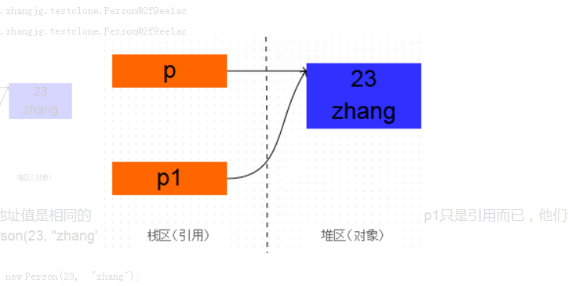
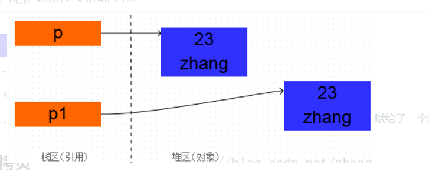
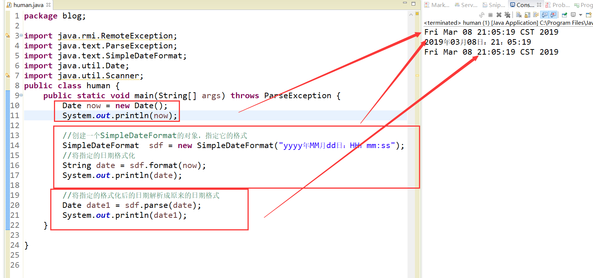

[toc]

# Java笔记18-包装类与常用类

## 包装类

Java语言是面向对象的语言，其设计理念是“一切皆对象”。但8种基本数据类型却出现了例外，它们不具备对象的特性。为了解决这个问题，Java为每个基本数据类型都定义了一个对应的引用类型，这就是包装类。例如当某个方法需要Object类型的参数，但实际传入的值却是数字的话，就需要做特殊的处理了。有了包装类，这种问题就可以得以简化。

通过包装类可以把基本数据类型包装为数据类型的对象，当作对象处理。

基本数据类型 |	对应的包装类
------------ | -------------
byte  |	Byte
short |	Short
int  |	Integer
long  |	Long
char  |	Character
float  | 	Float
double |	Double
boolean |	Boolean

> 装箱与拆箱

- 装箱就是将基本数据类型转换为包装器类型（int-->Integer）；调用方法：Integer的 valueOf(int) 方法。

- 拆箱就是将包装器类型转换为基本数据类型（Integer-->int）。调用方法：Integer的 intValue 方法。

1. 自动装箱：可以把一个基本类型的数据直接赋值给对应的包装类型；java会在编译期间自动转换。
2. 自动拆箱：可以把一个包装类型的对象直接赋值给对应的基本类型；java会在编译期间自动转换。
3. 通过自动装箱、自动拆箱功能，可以大大简化基本类型变量和包装类对象之间的转换过程。

```java
//int类型的装箱操作：
int a=10;
//手动装箱
Integer in=new Integer(a);
//自动转箱
Integer in2=a;
System.out.println(in.toString()+","+in2.toString());

//Integer的拆箱操作：
//手动拆箱
int num=in.intValue();
//自动拆箱
int num2=in2;
System.out.println(num+","+num2);
```


## Object类

Object类位于java.lang包中，是所有Java类的祖先。每个类都使用 Object 作为父类。所有对象（包括数组）都实现了这个类的方法。可以使用类型为Object的变量指向任意类型的对象。

Object类中的方法如下
```
hashcode() 
equals() 
toString() 
getClass()
waitnotify() 
notifyAll() 
finalize()
```

1. hashCode方法就是根据一定的规则将与对象相关的信息（比如对象的存储地址，对象的字段等）映射成一个数值，这个数值称作为散列值。
2. equals()方法 比较两个对象是否相等。每个对象都拥有标识(内存地址)和状态(数据)。equals()方法是比较两个对象的内存地址是否相等，即是否引用同一个对象。
3. toString()方法。返回一个字符串，该字符串由类名、at 标记符“@”和此对象哈希码的无符号十六进制表示组成


### finalize()方法

finalize()方法：是垃圾回收器操作的运行机制中的一部分，进行垃圾回收器操作时会先调用finalize方法，因为finalize方法是object的方法，所以每个类都有这个方法并且可以重写这个方法，在这个方法里实现释放系统资源及其他清理工作，注意：JVM不保证此方法总被调用。

注意：
1. 对象不一定会被回收。
2. 垃圾回收不是析构函数。
3. 垃圾回收只与内存有关。
4. 垃圾回收和finalize()都是靠不住的，只要JVM还没有快到耗尽内存的地步，它是不会浪费时间进行垃圾回收的

### clone()方法

clone()方法用于快速创建一个已有对象的副本

克隆的步骤：1：创建一个对象； 2：将原有对象的数据导入到新创建的数据中。

<span style="color: red;">
注意：

1. Object.clone()方法会返回一个Object对象。必须进行强制类型转换才能得到我们需要的类型。
2. 其次clone()方法是创建一个新的对象，原对象和克隆对象的哈希值是不一样的。

</span>

### 浅拷贝深拷贝

可以通过clone()方法实现深拷贝。

浅拷贝:拷贝对象的引用值
```java
Person p = new Person(23, "zhang"); 
Person p1 = p;
```


深拷贝：完全复制一个新对象
```java
Person p = new Person(23, "zhang"); 
Person p1 = (Person) p.clone();
```


## 字符串

### String类

Java 提供了 String 类来创建和操作字符串。String类是被final修饰，因此String类不可以被继承。

>①求字符串的长度,连接两个字符串：
```java
String name="xiaoming";  //创建字符串name变量
String name2="xiaoqiang";

int len=name.length();   //字符串的长度
System.out.println("name变量的长度为 "+len);

//连接两个字符串：
String name3=name.concat(name2);
System.out.println(name3);
```

>②字符串转换为字符数组,把字符串进行大小写转换：
```java
String name="xiaoming";  //创建字符串name变量
char [] ch=name.toCharArray();
	for(char c:ch){
	System.out.println(c);
	}

//把字符串进行大小写转换
System.out.println(name.toLowerCase());
System.out.println(name.toUpperCase());
```

>③字符串的判断操作：
```java
String name="xiaoming";  //创建字符串name变量
String name2="xiaoqiang";

System.out.println("判断字符串是否以xiao开头："+name.startsWith("xiao"));
System.out.println("判断字符串是否以g结尾： "+name.endsWith("g"));
System.out.println("判断字符串是否包含ao "+name.contains("ao"));
System.out.println("判断字符串是否为空 "+name.isEmpty());
System.out.println("判断两个字符串是否相等 "+name.equals(name2));
```

String类常用方法如下


#### String类为什么要用final修饰？

之所以要把String类设计为不可变类，主要是出于安全和性能的考虑，可归纳为如下4点。

1. 由于字符串在任何 Java 系统中都广泛使用，会用来存储敏感信息，如账号，密码等，那么保证字符串 String 类的安全性就尤为重要了，如果字符串是可变的，容易被篡改，那我们就无法保证使用字符串进行操作时，它是安全的，很有可能出现 SQL 注入，访问危险文件等操作。
2. 在多线程中，只有不变的对象和值是线程安全的，可以在多个线程中共享数据。由于 String 天然的不可变，当一个线程”修改“了字符串的值，只会产生一个新的字符串对象，不会对其他线程的访问产生副作用，访问的都是同样的字符串数据，不需要任何同步操作。
3. 字符串作为基础的数据结构，大量地应用在一些集合容器之中，尤其是一些散列集合，在散列集合中，存放元素都要根据对象的 hashCode() 方法来确定元素的位置。由于字符串 hashcode 属性不会变更，保证了唯一性，使得类似 HashMap，HashSet 等容器才能实现相应的缓存功能。由于 String 的不可变，避免重复计算 hashcode，只要使用缓存的 hashcode 即可，这样一来大大提高了在散列集合中使用 String 对象的性能。
4. 当字符串不可变时，字符串常量池才有意义。字符串常量池的出现，可以减少创建相同字面量的字符串，让不同的引用指向池中同一个字符串，为运行时节约很多的堆内存。若字符串可变，字符串常量池失去意义，每次创建新的字符串将在堆内开辟出新的空间，占据更多的内存。
5. 因为要保证String类的不可变，那么将这个类定义为final的就很容易理解了。如果没有final修饰，那么就会存在String的子类，这些子类可以重写String类的方法，强行改变字符串的值，这便违背了String类设计的初衷。

### StringBuffer类

StringBuffer类 和 String 类不同的是，StringBuffer 和 StringBuilder 类的对象能够被多次的修改，并且不产生新的未使用对象。

```java
StringBuffer sBuffer = new StringBuffer("菜鸟教程官网：");
sBuffer.append("www");
sBuffer.append(".runoob");
sBuffer.append(".com");
System.out.println(sBuffer);

//运行结果：菜鸟教程官网：www.runoob.com
```


### String 和 StringBuilder、StringBuffer 的区别？

String
- 底层使用的是 private final char[] value 保存字符串。因此String对象是不可变的。
- 因为对象不可变，线程安全

StringBuffer
- 底层用char[] value 保存字符串。因此StringBuffer对象是可变的。
- 内部方法都通过synchronized关键字修饰。线程安全

StringBuilder
- 底层用char[] value 保存字符串。因此StringBuilder对象是可变的。
- 非线程安全。

速度比较： StirngBuilder > StringBuffer > String

## Math 类

Math 类提供各种数学公式。

```java
System.out.println("90 度的正弦值：" + Math.sin(Math.PI/2));  
System.out.println("0度的余弦值：" + Math.cos(0));  
System.out.println("60度的正切值：" + Math.tan(Math.PI/3));  
System.out.println("1的反正切值： " + Math.atan(1));  
System.out.println("π/2的角度值：" + Math.toDegrees(Math.PI/2));  
System.out.println(Math.PI);  
```

## Scanner 类

通过 Scanner 类的 next() 与 nextLine() 方法可以获取键盘输入的字符串。

>①使用 next 方法：

```java
Scanner scan = new Scanner(System.in);
// 从键盘接收数据
System.out.println("next方式接收：");

if (scan.hasNext()) {    // 判断是否还有输入
	String str1 = scan.next();
	System.out.println("输入的数据为：" + str1);
}
scan.close();

// 运行结果
// 输入：xiao ming
// 输出：xiao 
```


<span style="color: red;">

next()的方法的特征:
1、一定要读取到有效字符后才可以结束输入。
2、对输入的空白，next()方法会自动将其去掉。
3、只有输入有效字符后才将其后面输入的空白作为分隔符或者结束符。
next() 不能得到带有空格的字符串。

</span>


>②使用 nextLine 方法：

```java
Scanner scan = new Scanner(System.in);
// 从键盘接收数据
System.out.println("nextLine方式接收：");
if (scan.hasNextLine()) {
	String str2 = scan.nextLine();
	System.out.println("输入的数据为：" + str2);
}
scan.close();
```

<span style="color: red;">

nextLine()的特征：
1、以Enter为结束符,即nextLine()方法返回的是输入回车之前的所有字符。
2、可以获得空白字符。

</span>


## Date类与Calendar类

>①Date类
```java
Date now = new Date();
System.out.println(now);

//创建一个SimpleDateFormat的对象，指定它的格式
SimpleDateFormat  sdf = new SimpleDateFormat("yyyy年MM月dd日：HH：mm:ss");
//将指定的日期格式化
String date = sdf.format(now);
System.out.println(date);

//将指定的格式化后的日期解析成原来的日期格式
Date date1 = sdf.parse(date);
System.out.println(date1);
```


>②Calendar类
```java
Calendar  c = Calendar.getInstance();
System.out.println(c);
//获取年份
int year = c.get(Calendar.YEAR);
//获取月份，由于月份是从0开始计算的，所以+1
int month = c.get(Calendar.MONTH)+1;
//获取天数
int day = c.get(Calendar.DAY_OF_MONTH);
//获取小时
int hour = c.get(Calendar.HOUR);
//获取分钟数
int minute = c.get(Calendar.MINUTE);
//获取秒数
int second = c.get(Calendar.SECOND);

//把Calendar类型转换成Date类型
Date date = c.getTime();

//把Date类型转换成Calendar类型
c.setTime(date);

//Date类型是标准的时间
SimpleDateFormat  sfd = new SimpleDateFormat("yyyy年MM月dd日：HH时mm分ss秒");
String dates = sfd.format(date);
System.out.println("Date类的打印现在时间： "+dates);
//而由上面的get 到的都是一般的十二进制的数，不是标准的时间输出
System.out.println("Calendar类的打印现在时间： "+year+"年"+month+"月"+day+"日"+hour+"时"+minute+"分"+second+"秒");
```

