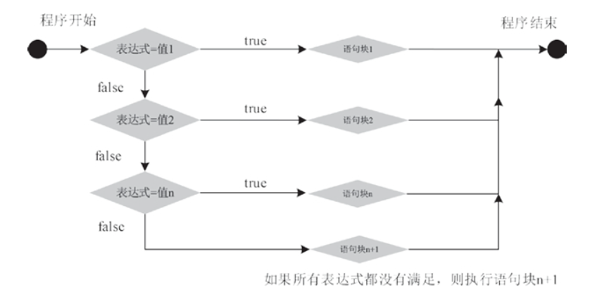

[toc]

# Java笔记2-流程控制

## 条件语句

###  if else语句

语法格式如下：
```java
//if的用法如下：
if(布尔表达式)
{
   //如果布尔表达式为true将执行的语句
}

//if…else 的用法如下：
if(布尔表达式){
   //如果布尔表达式的值为true
}else{
   //如果布尔表达式的值为false
}

//if...elseif...else 语句的用法：
if(布尔表达式 1){
   //如果布尔表达式 1的值为true执行代码
}else if(布尔表达式 2){
   //如果布尔表达式 2的值为true执行代码
}else if(布尔表达式 3){
   //如果布尔表达式 3的值为true执行代码
}else {
   //如果以上布尔表达式都不为true执行代码
}
```

### switch 条件语句

语法格式如下：
```java
switch(表达式) {
    case 值1:
        //语句块1;
        break;
    case 值2:
        //语句块2;
        break;
    …
    case 值n:
        //语句块n;
        break;
    default:
        //语句块n+1;
        break;
}
```

<span style="color: red;">

注意:
1. case 语句中的值的数据类型必须与变量的数据类型相同，而且只能是常量或者字面常量。 
2. default分支 在没有 case 语句的值和变量值相等的时候执行。
3. 如果当前匹配成功的 case 语句块没有 break 语句，则从当前 case 开始，后续所有 case 的值都会输出，如果后续的 case 语句块有 break 语句则会跳出switch判断。

</span>

switch语句执行流程图：


#### switch表达式

switch表达式可以使用int类型或者能转换为int类型的变量，包装类。

长整型（long）和 浮点型（double,float）不行，其余类型目前都可以。

## 循环语句

### while 循环,do…while 循环

语法：
```java
while( 布尔表达式 ) {
//若布尔表达式为 true，则语句块一直循环
}

do {
//先执行一次do语句,若布尔表达式的值为 true，则语句块一直循环
}while(布尔表达式);
```

while 循环和 do-while 循环的不同处如下：
* 执行次序不同：while 循环先判断，再执行。do-while 循环先执行，再判断。
* 一开始循环条件就不满足的情况下，while 循环一次都不会执行，do-while 循环则不管什么情况下都至少执行一次。


### for循环

<span style="color: red;">for语句通常使用在知道循环次数的循环中。</span>

语法格式如下：
```java
for(初始化; 条件表达式; 循环控制变量) {
    //代码语句
}
//for循环步骤：
//1.最先执行初始化。
//2.然后，检测条件表达式的值。如果为 true，循环体被执行。如果为false，循环终止，开始执行循环体后面的语句。
//3.执行一次循环后，更新循环控制变量。
//4.再次检测条件表达式。循环执行上面的过程。

//打印10次输出语句
for(int x = 10; x < 20; x = x+1) {
         System.out.print("value of x : " + x );
         System.out.print("\n");
}
```

for 循环语句执行的过程为：
1. 首先进行初始化，然后判断条件表达式是否为 true，
2. 如果为 true，则执行循环体语句块；否则直接退出循环。
3. 最后改变循环变量的值，至此完成一次循环。
4. 接下来进行下一次循环，直到条件表达式为 false，才结束循环。


### 增强for循环：foreach语句

③ 增强for循环

<span style="color: red;">foreach 循环语句是 for 语句的特殊简化版本，主要用于执行遍历功能的循环。</span>

```java
//语法格式如下：
for(数据类型 变量名:集合) {
    语句块;
}

//例子
int [] numbers = {10, 20, 30, 40, 50};
for(int x : numbers ){
    System.out.print(x);
}
String [] names ={"James", "Larry", "Tom", "Lacy"};
for(String name : names ) {
    System.out.print(name);
}
```

## 关键字: break,continue

### break关键字

break 用于完全结束一个循环，跳出循环体。不管是哪种循环语句，一旦在循环体中遇到break，系统将完全结束该循环，开始执行循环之后的代码。

<span style="color: red;">注意：对于多个循环嵌套的语句，break只能结束当前所在的循环，无法影响其他循环。</span>

```java
int [] numbers = {10, 20, 30, 40, 50};
for(int x : numbers ) {
    // x 等于 30 时跳出循环
    if( x == 30 ) {
      break; //跳出for循环
    }
    System.out.print( x );
}
```

### continue关键字

continue是跳过循环体中剩余的语句而强制执行下一次循环。其作用为中止当前迭代的循环，进入下一次的迭代。

<span style="color: red;">注意：continue 语句只能用在 while 语句、for 语句或者 foreach 语句的循环体之中，在这之外的任何地方使用它都会引起语法错误。</span>

```java
int [] numbers = {10, 20, 30, 40, 50};
for(int x : numbers ) {
    if( x == 30 ) {
        continue;      //当x为30时，跳过这次循环，相当与不打印30语句
    }
    System.out.print( x );
}
```


