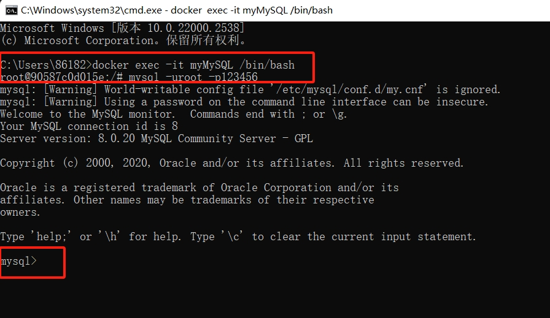
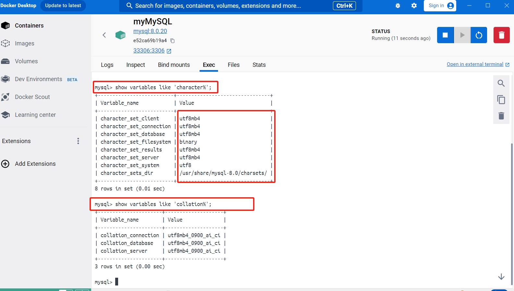

[toc]

# MySQL笔记1

## 数据库是什么？

数据库（Database）指长期存储在计算机内的、有组织的、可共享的数据集合。通俗的讲，数据库就是存储数据的地方。

数据库实际上就是一个文件集合，是一个存储数据的仓库，本质就是一个文件系统，数据库是按照特定的格式把数据存储起来，从而让用户可以对存储的数据进行增删改查操作。

数据库管理系统（DBMS）是位于用户与操作系统之间的数据管理软件，用于建立，使用和维护数据库。它的主要功能包括数据定义、数据操作、数据库的运行管理、数据库的建立和维护等几个方面。

我们常说XX数据库，实质上是XX数据库管理系统。目前，较为流行的数据库管理系统有 MySQL、SQL Server、Oracle 等。

## 数据库的分类

数据库有两种类型，分别是关系型数据库和非关系型数据库。

### 关系型数据库

关系型数据库是建立在关系模型基础上的数据库，借助于集合代数等数学概念和方法来处理数据库中的数据。简单说，关系型数据库是由多张能互相连接的表组成的数据库。

优点
- 都是使用表结构，格式一致，易于维护。
- 使用通用的 SQL 语言操作，使用方便，可用于复杂查询。
- 数据存储在磁盘中，安全。

缺点
- 读写性能比较差，不能满足海量数据的高效率读写。
- 不节省空间。因为建立在关系模型上，就要遵循某些规则，比如数据中某字段值即使为空仍要分配空间。
- 固定的表结构，灵活度较低。

常见的关系型数据库有 Oracle、DB2、PostgreSQL、Microsoft SQL Server、Microsoft Access 和 MySQL 等。

### 非关系型数据库

非关系型数据库又被称为 NoSQL（Not Only SQL )，意为不仅仅是 SQL。通常指数据以对象的形式存储在数据库中，而对象之间的关系通过每个对象自身的属性来决定。

优点
- 非关系型数据库存储数据的格式可以是 key-value 形式、文档形式、图片形式等。使用灵活，应用场景广泛，而关系型数据库则只支持基础类型。
- 速度快，效率高。 NoSQL 可以使用硬盘或者随机存储器作为载体，而关系型数据库只能使用硬盘。
- 海量数据的维护和处理非常轻松。
- 非关系型数据库具有扩展简单、高并发、高稳定性、成本低廉的优势。
- 可以实现数据的分布式处理。

缺点
- 非关系型数据库暂时不提供 SQL 支持，学习和使用成本较高。
- 非关系数据库没有事务处理，没有保证数据的完整性和安全性。适合处理海量数据，但是不一定安全。
- 功能没有关系型数据库完善。

常见的非关系型数据库有 Neo4j、MongoDB、Redis、Memcached、MemcacheDB 和 HBase 等。

## MySQL是什么？

MySQL 是最流行的数据库之一，是一个免费开源的关系型数据库管理系统。MySQL 适合中小型软件，被个人用户以及中小企业青睐。

针对不同的用户，MySQL分为两个版本：
- MySQL Community Server（社区版）：该版本是自由下载且完全免费的，但是官方不提供技术支持。
- MySQL Enterprise Server（企业版）：该版本是收费的，而且不能下载，但是该版本拥有完善的技术支持。

> MySQL的特点
* MySQL 是开放源代码的免费的数据库。
* MySQL 是开放源代码的数据库，不仅在 Windows上运行，还可以在 UNIX、Linux 和 Mac OS 等操作系统上运行。
* MySQL 是一个真正的多用户、 多线程 SQL 数据库服务器。

## MySQL的安装与配置

在 Windows 操作系统下，MySQL 数据库的安装包分为图形化界面安装和免安装这两种安装包。
- 图形化界面安装包有完整的安装向导，安装和配置很方便。
- 免安装的安装包直接解压即可使用，但是配置起来不方便。

关于MySQL的安装和配置，自行百度


## Mysql的初步使用

当安装mysql后，mysql服务便运行在系统中。此时我们可以通过命令行来登录 MySQL 数据库并通过命令来操控数据库。

<span style="color: red;">注意-u 与 root之间可以有空格也可以没有空格，但是密码前必须没有空格。-h可以不写，默认为127.0.0.1</span>

```
1. 登录Mysql:
格式： mysql -h主机地址 -u用户名 －p用户密码

> mysql -u root -p
> Enter password:密码

若连接远程主机
(如果远程主机的IP为110.110.110.110，用户名为root,密码为abcd123)
> mysql -h110.110.110.110 -u root -p abcd123;

2.退出mysql命令模式
mysql>exit

3.修改密码:
格式：mysqladmin -u用户名 -p旧密码 password 新密码

mysql>mysqladmin -uroot -pabcd123 password abcd456;

4.创建数据库
mysql> create database 数据库名;

5. 显示数据库，修改数据库默认编码:
mysql> show databases;

6.删除数据库
mysql> drop database 数据库名;

7. 连接或切换数据库(用于在命令行中对其他数据库进行操作)：
mysql> use 数据库名;

8.显示当前使用的数据库名称：
mysql> select database();

9.显示MYSQL的版本
mysql> select version(); 

10.显示当前时间:
mysql> select now(); 
mysql> SELECT YEAR(CURRENT_DATE);    ##显示年月日
mysql> SELECT MONTH(CURRENT_DATE); 
mysql> SELECT DAYOFMONTH(CURRENT_DATE); 

11.显示字符串：
mysql> SELECT "welecome to my blog!"; 

12.当计算器用:
mysql> select ((4 * 4) / 10 ) + 25; 

```

## MySQL常用图形化管理工具

MySQL 图形化管理工具极大地方便了数据库的操作与管理，常用的图形化管理工具还有 MySQL Workbench、phpMyAdmin、Navicat、MySQLDumper、SQLyog、MySQL ODBC Connector。

> MySQL Workbench

MySQL Workbench MySQL 是官方提供的图形化管理工具，分为社区版和商业版，社区版完全免费，而商业版则是按年收费。支持数据库的创建、设计、迁移、备份、导出和导入等功能，并且支持 Windows、Linux 和 mac 等主流操作系统。

> phpMyAdmin

phpMyAdmin 是最常用的 MySQL 维护工具，使用 PHP 编写，通过 Web 方式控制和操作 MySQL 数据库，是 Windows 中 PHP 开发软件的标配。通过 phpMyAdmin 可以完全对数据库进行操作，例如建立、复制、删除数据等。管理数据库非常方便，并支持中文，不足之处在于对大数据库的备份和恢复不方便，对于数据量大的操作容易导致页面请求超时。

> Navicat

Navicat MySQL 是一个强大的 MySQL 数据库服务器管理和开发工具。它可以与任何版本的 MySQL 一起工作，支持触发器、存储过程、函数、事件、视图、管理用户等。对于新手来说也易学易用。Navicat 使用图形化的用户界面（GUI），可以让用户用一种安全简便的方式来快速方便地创建、组织、访问和共享信息。Navicat 支持中文，有免费版本提供。

> SQLyog

SQLyog 是一款简洁高效、功能强大的图形化管理工具。SQLyog 操作简单，功能强大，能够帮助用户轻松管理自己的 MySQL 数据库。SQLyog 中文版支持多种数据格式导出，可以快速帮助用户备份和恢复数据，还能够快速地运行 SQL 脚本文件，为用户的使用提供便捷。使用 SQLyog 可以快速直观地让用户从世界的任何角落通过网络来维护远端的 MySQL 数据库。

## 在docker环境中安装MySQL容器

在windows系统中，安装docker环境，并在docker环境中安装mysqL容器。

步骤① 先安装docker环境，自行百度。

步骤② 下载mysql镜像文件。最新版或某个版本

```shell
# 下载mysql 8.0.20版本的镜像
docker pull mysql:8.0.20
# 查询镜像
docker images
```

步骤③：创建并启动mysql容器

```shell
# 创建mysql容器
# --name="myMySQL" myMySQL是容器的名称
# -d 后台启动
# -e MYSQL_ROOT_PASSWORD=123456 , -e 设置环境变量。此处是设置mysql密码
# -p 33306:3306 , 宿主机的33306端口映射到容器的3306端口
# -v 设置容器数据卷
# /d/DockerVolumes/mysql/log 是宿主机目录 /var/log/mysql 是容器存放日志信息的目录
# /d/DockerVolumes/mysql/data 是宿主机目录 /var/lib/mysql 是容器存放数据库数据的目录
# /d/DockerVolumes/mysql/conf.d 是宿主机目录 /etc/mysql/conf.d 是容器存放配置文件的目录

docker run -d -p 33306:3306 --name="myMySQL" -e MYSQL_ROOT_PASSWORD=123456 -v /d/DockerVolumes/mysql/log:/var/log/mysql -v /d/DockerVolumes/mysql/data:/var/lib/mysql -v /d/DockerVolumes/mysql/conf.d:/etc/mysql/conf.d mysql:8.0.20

# 查询容器日志，看是否成功启动。
docker logs myMySQL
```

由于宿主机的操作系统是windows，因此`/d/DockerVolumes/`是指D盘中的DockerVolumes目录。如果宿主机操作系统是linux,请自行选择宿主机目录。


步骤④：进入到mysql容器中

```shell
# 进入到容器中
docker exec -it myMySQL /bin/bash
# 进入到mysql命令行模式
mysql -uroot -p123456
```



### 解决docker中的mysql容器的中文字符编码问题

1. 先进入到mysql容器的mysql终端中，容器名称为myMySQL
```shell
# 先进入到容器终端
docker exec -it myMySQL /bin/bash
# 登录进入到mysql终端
mysql -uroot -p123456
# 查询mysql的字符集
mysql> show variables like 'character%';
mysql> show variables like 'collation%';
```


如图所示，由于在mysql容器中的字符编码不是utf8。因此我们需要重新设置mysql的字符编码。由于上面创建mysql容器的时候设置了容器数据卷。因此可以直接在宿主机的conf.d目录中创建my.cnf配置文件即可。

1. 在conf.d目录中创建my.cnf配置文件。并添加字符编码配置。

不同版本的mysql的修改字符编码的方式不同。下面是mysql 8.0.20版本的配置写法。
```shell
[mysqld]
init-connect="SET collation_connection=utf8mb4_0900_ai_ci"
init_connect="SET NAMES utf8mb4"
skip-character-set-client-handshake
```

3. 重新启动mysql容器，让配置文件生效。

```shell
# 重启容器，
docker restart myMySQL

# 注意如果配置文件错误，会导致容器重启失败。此时可以查询docker容器日志来寻找原因。
# 查询mysql01容器的日志信息
docker logs myMySQL 
```

4. 如图所示，字符编码改为了utf8mb4。


