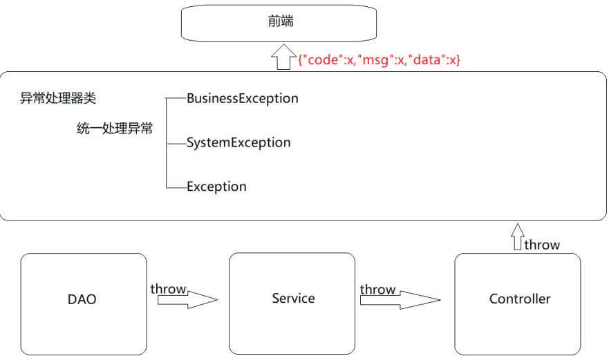
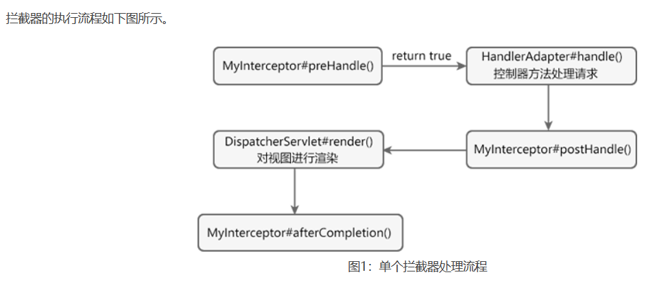
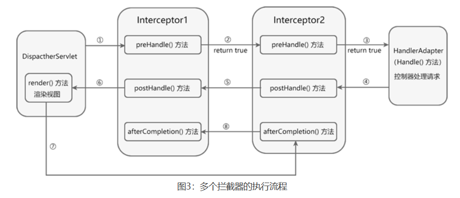
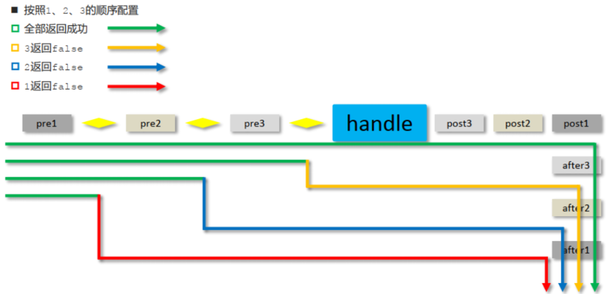

[toc]

# SpringMVC笔记3

当前SpringMVC的版本为5.3.22

## RESTful风格

RESTful是一种新的请求方式风格。

RESTFul 提倡我们使用统一的风格来设计请求 URL，其规则如下。

* 请求URL只用来标识和定位资源，不得包含任何与操作相关的动词。
* 当请求中需要携带参数时，RESTFul 允许将参数通过斜杠（/）拼接到 URL 中。
* HTTP 协议中有四个表示操作方式的动词：GET 用来获取资源， POST 用来新建资源， PUT 用来更新资源， DELETE 用来删除资源。

下图是传统方式请求URL与RESTful方式请求URL的对比。


> RESTful风格的分类:
* RESTful风格下请求的方式不同，则代表不同的具体操作。
* `http://localhost/users`	  查询全部用户信息 GET（查询）
* `http://localhost/users/1`  查询指定用户信息 GET（查询）
* `http://localhost/users`    添加用户信息 POST（新增）
* `http://localhost/users`    修改用户信息 PUT（更新）
* `http://localhost/users/1`  删除用户信息 DELETE（删除）
* 发送GET请求是用来做查询
* 发送POST请求是用来做新增
* 发送PUT请求是用来做修改
* 发送DELETE请求是用来做删除

<span style="color: red;">注意：RESTful风格是约定方式，约定不是规范，可以打破，所以称RESTful风格，而不是RESTful规范。</span>

> RESTful的例子

以下是RESTful的例子
```java
@Controller
public class BookController {
    //新增，POST请求
    @RequestMapping(value = "/books",method = RequestMethod.POST)
    @ResponseBody
    public String save(@RequestBody Book book){
        System.out.println("book save..." + book);
        return "{'module':'book save'}";
    }

    //删除，DELETE请求
    @RequestMapping(value = "/books/{id}",method = RequestMethod.DELETE)
    @ResponseBody
    public String delete(@PathVariable Integer id){
        System.out.println("book delete..." + id);
        return "{'module':'book delete'}";
    }

    //修改，PUT请求
    @RequestMapping(value = "/books",method = RequestMethod.PUT)
    @ResponseBody
    public String update(@RequestBody Book book){
        System.out.println("book update..." + book);
        return "{'module':'book update'}";
    }

    //查询，GET请求
    @RequestMapping(value = "/books/{id}",method = RequestMethod.GET)
    @ResponseBody
    public String getById(@PathVariable Integer id){
        System.out.println("book getById..." + id);
        return "{'module':'book getById'}";
    }

    //查询全部，GET请求
    @RequestMapping(value = "/books",method = RequestMethod.GET)
    @ResponseBody
    public String getAll(){
        System.out.println("book getAll...");
        return "{'module':'book getAll'}";
    }
}
```

上面例子中，有些代码的重复性太高。下面是改进后的例子
```java
@Controller
@RequestMapping("/books")
public class BookController {
    //新增
	//@RequestMapping(method = RequestMethod.POST)
    @PostMapping
    @ResponseBody
    public String save(@RequestBody Book book){
        System.out.println("book save..." + book);
        return "{'module':'book save'}";
    }
    //删除
    //@RequestMapping(value = "/{id}",method = RequestMethod.DELETE)
    @DeleteMapping("/{id}")
    @ResponseBody
    public String delete(@PathVariable Integer id){
        System.out.println("book delete..." + id);
        return "{'module':'book delete'}";
    }
    //修改
    //@RequestMapping(method = RequestMethod.PUT)
    @PutMapping
    @ResponseBody
    public String update(@RequestBody Book book){
        System.out.println("book update..." + book);
        return "{'module':'book update'}";
    }
    //查询
    //@RequestMapping(value = "/{id}",method = RequestMethod.GET)
    @GetMapping("/{id}")
    @ResponseBody
    public String getById(@PathVariable Integer id){
        System.out.println("book getById..." + id);
        return "{'module':'book getById'}";
    }
    //查询全部
    //@RequestMapping(method = RequestMethod.GET)
    @GetMapping
    @ResponseBody
    public String getAll(){
        System.out.println("book getAll...");
        return "{'module':'book getAll'}";
    }
    
}
```

## SpringMVC设置静态资源放行

请求路径：`http://localhost/pages/books.html`

当访问上面的路径的时候，SpringMVC根据/pages/books.html请求路径去controller找对应的方法，找不到会报404的错误。

> SpringMVC为什么会拦截静态资源呢?

之前在自定义servlet web容器配置类中，设置了拦截所有请求。自然将获取静态资源的请求也拦截了。

```java
//自定义servlet web容器配置类
public class ServletContainersInitConfig extends AbstractDispatcherServletInitializer {
    //.......................省略
    
    //拦截所有请求，并将所有请求交给spring mvc处理
    // "/" 满足/pages/books.html规则
    protected String[] getServletMappings() {
        return new String[]{"/"};
    }
}
```

> SpringMVC如何设置静态资源放行?

新建SpringMvcSupport配置类，继承WebMvcConfigurationSupport类。设置静态资源放行
```java
@Configuration
public class SpringMvcSupport extends WebMvcConfigurationSupport {
    //设置静态资源访问过滤，当前类需要设置为配置类，并被扫描加载
    @Override
    protected void addResourceHandlers(ResourceHandlerRegistry registry) {
        //当访问/pages/????时候，从/pages目录下查找内容
        registry.addResourceHandler("/pages/**").addResourceLocations("/pages/");
        registry.addResourceHandler("/js/**").addResourceLocations("/js/");
        registry.addResourceHandler("/css/**").addResourceLocations("/css/");
        registry.addResourceHandler("/plugins/**").addResourceLocations("/plugins/");
    }
}
```

* 该配置类是在config目录下，SpringMvcConfig配置类扫描的是controller包，所以该配置类还未生效，要想生效需要对SpringMvcConfig配置类进行修改。让其扫描config目录。

```java
@Configuration
@ComponentScan({"com.itheima.controller","com.itheima.config"})
@EnableWebMvc
public class SpringMvcConfig {
}
```


## SpringMVC 设置统一响应结果

随着业务的增长，我们需要返回的数据类型会越来越多。对于前端开发人员在解析数据的时候就比较凌乱了，所以对于前端来说，如果后台能够返回一个统一的数据结果，前端在解析的时候就可以按照一种方式进行解析。开发就会变得更加简单。

统一响应结果封装思路分析为:
* 为了封装返回的结果数据:创建响应结果类，封装响应数据到data属性中
* 为了封装返回的数据是何种操作及是否操作成功:封装操作结果到code属性中
* 操作失败后为了封装返回的错误信息:封装特殊消息到message(msg)属性中


① 步骤1:创建Result统一响应结果类

```java
public class Result {
    //响应内容数据
    private Object data;
    //响应结果编码，用于区分操作。可以用简化配置0或1表示成功失败
    private Integer code;
    //响应结果消息消息，可选属性
    private String msg;

    public Result() {
    }
    public Result(Integer code,Object data) {
        this.data = data;
        this.code = code;
    }
    public Result(Integer code, Object data, String msg) {
        this.data = data;
        this.code = code;
        this.msg = msg;
    }
	//setter...getter...省略
}
```

② 步骤2:定义返回码Code类

```java
//状态码
public class Code {
    public static final Integer SAVE_OK = 20011;
    public static final Integer DELETE_OK = 20021;
    public static final Integer UPDATE_OK = 20031;
    public static final Integer GET_OK = 20041;
    public static final Integer SAVE_ERR = 20010;
    public static final Integer DELETE_ERR = 20020;
    public static final Integer UPDATE_ERR = 20030;
    public static final Integer GET_ERR = 20040;
}
```

③ 步骤3:修改Controller类的返回值

```java
//统一每个方法的响应结果
@RestController
@RequestMapping("/books")
public class BookController {
    @Autowired
    private BookService bookService;

    @PostMapping
    public Result save(@RequestBody Book book) {
        boolean flag = bookService.save(book);
        return new Result(flag ? Code.SAVE_OK:Code.SAVE_ERR,flag);
    }

    @PutMapping
    public Result update(@RequestBody Book book) {
        boolean flag = bookService.update(book);
        return new Result(flag ? Code.UPDATE_OK:Code.UPDATE_ERR,flag);
    }

    @DeleteMapping("/{id}")
    public Result delete(@PathVariable Integer id) {
        boolean flag = bookService.delete(id);
        return new Result(flag ? Code.DELETE_OK:Code.DELETE_ERR,flag);
    }

    @GetMapping("/{id}")
    public Result getById(@PathVariable Integer id) {
        Book book = bookService.getById(id);
        Integer code = book != null ? Code.GET_OK : Code.GET_ERR;
        String msg = book != null ? "" : "数据查询失败，请重试！";
        return new Result(code,book,msg);
    }
}
```

④ 步骤4:启动服务测试

此时前端可以根据返回的结果，先从中获取code,根据code判断，如果成功则取data属性的值，如果失败，则取msg中的值做提示。

## SpringMVC 设置统一异常处理

异常的种类及出现异常的原因:
- 框架内部抛出的异常：因使用不合规导致
- 数据层抛出的异常：因外部服务器故障导致（例如：服务器访问超时）
- 业务层抛出的异常：因业务逻辑书写错误导致（例如：遍历业务书写操作，导致索引异常等）
- 表现层抛出的异常：因数据收集、校验等规则导致（例如：不匹配的数据类型间导致异常）
- 工具类抛出的异常：因工具类书写不严谨不够健壮导致（例如：必要释放的连接长期未释放等）

SpringMVC对于异常的统一处理已经提供了一套解决方案:
* 自定义异常处理器: 集中的、统一的处理项目中出现的异常。
* 自定义异常处理器需要添加@RestControllerAdvice注解修饰


### 自定义异常处理器的使用

① 步骤1:创建自定义异常处理器类，并将异常内容封装为统一响应结果

```java
//@RestControllerAdvice用于标识当前类为REST风格对应的异常处理器
@RestControllerAdvice
public class ProjectExceptionAdvice {
    //除了自定义的异常处理器，保留对Exception类型的异常处理，用于处理非预期的异常
    //可以针对其他特殊异常进行专门异常处理。这个方法是针对Exception的异常处理
    @ExceptionHandler(Exception.class)
    public Result doException(Exception ex){
      	System.out.println("已发生异常");
        return new Result(666,null,"已发生异常");
    }
}
```

<span style="color: red;">确保SpringMvcConfig能够扫描到异常处理器类</span>

② 步骤2：修改SpringMVC配置类，让其能扫描到异常处理类

```java
@Configuration
@ComponentScan({"com.example.controller","com.example.util"})
@EnableWebMvc
public class SpringMVCConfig {
    //SpringMVC配置类
}
```

③ 步骤3:让程序抛出异常

```java
@GetMapping("/{id}")
public Result getById(@PathVariable Integer id) {
    //抛出异常
  	int i = 1/0;
    Book book = bookService.getById(id);
    Integer code = book != null ? Code.GET_OK : Code.GET_ERR;
    String msg = book != null ? "" : "数据查询失败，请重试！";
    return new Result(code,book,msg);
}
```

④ 步骤4:运行程序，测试

至此，就算后台执行的过程中抛出异常，最终也能按照统一响结果格式返回给前端。

### @RestControllerAdvice，@ExceptionHandler注解

@RestControllerAdvice注解（@ControllerAdvice + @ResponseBody + @Component）
类型: 类注解。
位置: 定义类上方。
作用: 为类做增强功能。

@ExceptionHandler 注解
类型: 方法注解。
位置: 专用于异常处理的控制器方法上方。
作用: 设置指定异常的处理方案，功能等同于控制器方法，出现异常后终止原始控制器执行,并转入当前方法执行。

**说明：** 此类方法可以根据处理的异常不同，制作多个方法分别处理对应的异常

### 自定义异常类 + 异常处理器

① 步骤1:自定义异常类

```java
//自定义异常处理器，用于封装异常信息，对异常进行分类
public class BusinessException extends RuntimeException{
    private Integer code;
    // message 和 cause 继承自RuntimeException类
    public Integer getCode() {
        return code;
    }
    public void setCode(Integer code) {
        this.code = code;
    }
    public BusinessException(Integer code, String message) {
        super(message);
        this.code = code;
    }
    public BusinessException(Integer code, String message, Throwable cause) {
        super(message, cause);
        this.code = code;
    }
}
```

**说明:**
* 让自定义异常类继承RuntimeException类的好处是，后期在抛出这两个异常的时候，就不用在try...catch...或throws了
* 自定义异常类中添加code属性的原因是为了更好的区分异常是来自哪个业务的

② 步骤2:将其他异常包成自定义异常

```java
public Book getById(Integer id) {
    //将可能出现的异常进行包装，转换成自定义异常并抛出
    try{
        int i = 1/0;
    }catch (Exception e){
        //抛出自定义异常
        throw new BusinessException(500,"服务器访问超时，请重试!",e);
    }
    return bookDao.getById(id);
}
```

具体的包装方式有：
* 方式一:`try{}catch(){}`在catch中重新throw我们自定义异常即可。
* 方式二:直接throw自定义异常即可

③ 步骤3:自定义异常处理器类中处理自定义异常

```java
//@RestControllerAdvice用于标识当前类为REST风格对应的异常处理器
@RestControllerAdvice
public class ProjectExceptionAdvice {
    //针对自定义异常BusinessException的异常处理
    @ExceptionHandler(BusinessException.class)
    public Result doBusinessException(BusinessException ex){
        //记录日志
        //发送消息给运维
        //发送邮件给开发人员,ex对象发送给开发人员
        return new Result(ex.getCode(),null,ex.getMessage());
    }

    //除了自定义的异常处理器，保留对Exception类型的异常处理，用于处理非预期的异常
    @ExceptionHandler(Exception.class)
    public Result doOtherException(Exception ex){
        //记录日志
        //发送消息给运维
        //发送邮件给开发人员,ex对象发送给开发人员
        return new Result(Code.SYSTEM_UNKNOW_ERR,null,"系统繁忙，请稍后再试！");
    }
}
```

④ 步骤4:运行程序

不管后台哪一层抛出异常，都会以我们与前端约定好的方式进行返回，前端只需要把信息获取到，根据返回的正确与否来展示不同的内容即可。

**小结**
上面例子的异常处理方式为:



## SpringMVC拦截器

### 拦截器介绍

讲拦截器之前，先看一张图:


(1)浏览器发送一个请求会先到Tomcat的web服务器
(2)Tomcat服务器接收到请求以后，会去判断请求的是静态资源还是动态资源
(3)如果是静态资源，会直接到Tomcat的项目部署目录下去直接访问
(4)如果是动态资源，就需要交给项目的后台代码进行处理
(5)在找到具体的方法之前，我们可以去配置过滤器(可以配置多个)，按照顺序进行执行
(6)然后进入到到中央处理器(SpringMVC的DispatcherServlet)，DispatcherServlet会根据配置的规则进行拦截
(7)如果满足规则，则进行处理，找到其对应的controller类中的方法进行执行,完成后返回结果
(8)如果不满足规则，则不进行处理
(9)这个时候，如果我们需要在每个Controller方法执行的前后添加业务，具体该如何来实现?
(10) 我们可以通过拦截器来实现这个功能。

> 什么是拦截器？

拦截器（Interceptor）是 Spring MVC 提供的一种强大的功能组件。它可以对用户请求进行拦截，并在请求进入控制器方法前后，执行一些指定的操作。

> 拦截器和过滤器在作用和执行顺序上很相似,那么拦截器和过滤器之间的区别是什么?

* 归属不同：过滤器Filter属于Servlet技术，拦截器Interceptor属于SpringMVC技术
* 拦截内容不同：过滤器Filter对所有访问进行过滤，拦截器Interceptor仅针对SpringMVC的方法进行拦截。


### 拦截器的执行流程

> 单个拦截器



拦截器处理流程的步骤如下：
1. 当请求的路径与拦截器拦截的路径相匹配时，程序会先执行拦截器类（MyInterceptor）的 preHandl() 方法。若该方法返回值为 true，则继续向下执行 Controller（控制器）中的方法，否则将不再向下执行；
2. 控制器方法对请求进行处理；
3. 调用拦截器的 postHandl() 方法，此时我们可以对请求域中的模型（Model）数据和视图做出进一步的修改；
4. 通过 DispatcherServlet 的 render() 方法对视图进行渲染；
5. 调用拦截器的 afterCompletion () 方法，完成资源清理、日志记录等工作。


> 多个拦截器

在项目中，通常都不会只有一个拦截器，多个不同的拦截器来实现不同的功能。在程序运行期间，拦截器的执行是有一定的顺序的，该顺序与拦截器在配置文件中定义的顺序有关。





如果其中有拦截器的 preHandle() 方法返回了 false，各拦截器方法执行情况如下。
* 第一个返回 preHandle() 方法 false 的拦截器以及它之前的拦截器的 preHandle() 方法都会执行。
* 所有拦截器的 postHandle() 都不会执行。
* 第一个返回 preHandle() 方法 false 的拦截器之前的拦截器的 afterComplation() 方法都会执行。


### 拦截器案例

#### 单个拦截器

① 步骤1:创建自定义拦截器类

自定义拦截器类需要实现HandlerInterceptor接口，重写HandlerInterceptor接口中的三个方法。

```java
@Component
//自定义拦截器类，实现HandlerInterceptor接口
//注意当前类必须受Spring容器控制
public class ProjectInterceptor implements HandlerInterceptor {
    @Override
    //原始方法调用前执行的内容
    public boolean preHandle(HttpServletRequest request, HttpServletResponse response, Object handler) throws Exception {
        System.out.println("preHandle...");
        return true;
    }

    @Override
    //原始方法调用后执行的内容
    public void postHandle(HttpServletRequest request, HttpServletResponse response, Object handler, ModelAndView modelAndView) throws Exception {
        System.out.println("postHandle...");
    }

    @Override
    //原始方法调用完成后执行的内容
    public void afterCompletion(HttpServletRequest request, HttpServletResponse response, Object handler, Exception ex) throws Exception {
        System.out.println("afterCompletion...");
    }
}
```

**注意:** 自定义拦截器类要被SpringMVC容器扫描到。

② 步骤2:把自定义拦截器类加入到SpringMvcSupport配置类中

```java
@Configuration
public class SpringMvcSupport extends WebMvcConfigurationSupport {
    @Autowired
    private ProjectInterceptor projectInterceptor;

    //.......

    //将自定义拦截器注册到SpringMvc配置类中
    @Override
    protected void addInterceptors(InterceptorRegistry registry) {
        //配置拦截器的拦截路径
        // 下面只会对/books路径及其子路径进行拦截
        registry.addInterceptor(projectInterceptor).addPathPatterns("/books","/books/*");
    }
}
```

③ 步骤3:SpringMVC添加SpringMvcSupport包扫描

```java
@Configuration
@ComponentScan({"com.itheima.controller","com.itheima.config"})
@EnableWebMvc
public class SpringMvcConfig{
}
```

④ 步骤4:运行程序测试

```java
preHandle...
postHandle...
afterCompletion...
```

⑤ 可以简化SpringMvcSupport配置类的编写

SpringMvcConfig配置类可以代替SpringMvcSupport配置类。之后就不用再写SpringMvcSupport类了。
```java
@Configuration
@ComponentScan({"com.itheima.controller"})
@EnableWebMvc
//实现WebMvcConfigurer接口可以简化开发，但具有一定的侵入性
public class SpringMvcConfig implements WebMvcConfigurer {
    @Autowired
    private ProjectInterceptor projectInterceptor;

    @Override
    public void addInterceptors(InterceptorRegistry registry) {
        //配置拦截器的拦截路径
        registry.addInterceptor(projectInterceptor).addPathPatterns("/books","/books/*");
    }
}
```

#### 多个拦截器

① 步骤1:创建多个拦截器类，实现HandlerInterceptor接口，并重写接口中的方法

```java
@Component
public class ProjectInterceptor implements HandlerInterceptor {
    @Override
    public boolean preHandle(HttpServletRequest request, HttpServletResponse response, Object handler) throws Exception {
        System.out.println("preHandle...");
        return true;
    }

    @Override
    public void postHandle(HttpServletRequest request, HttpServletResponse response, Object handler, ModelAndView modelAndView) throws Exception {
        System.out.println("postHandle...");
    }

    @Override
    public void afterCompletion(HttpServletRequest request, HttpServletResponse response, Object handler, Exception ex) throws Exception {
        System.out.println("afterCompletion...");
    }
}

//---------------------

@Component
public class ProjectInterceptor2 implements HandlerInterceptor {
    @Override
    public boolean preHandle(HttpServletRequest request, HttpServletResponse response, Object handler) throws Exception {
        System.out.println("preHandle...222");
        return false;
    }
    @Override
    public void postHandle(HttpServletRequest request, HttpServletResponse response, Object handler, ModelAndView modelAndView) throws Exception {
        System.out.println("postHandle...222");
    }

    @Override
    public void afterCompletion(HttpServletRequest request, HttpServletResponse response, Object handler, Exception ex) throws Exception {
        System.out.println("afterCompletion...222");
    }
}
```

② 步骤2:配置SpringMvcConfig类，将多个拦截器类注册其中

```java
@Configuration
@ComponentScan({"com.itheima.controller"})
@EnableWebMvc
public class SpringMvcConfig implements WebMvcConfigurer {
    //依赖多个拦截器
    @Autowired
    private ProjectInterceptor projectInterceptor;
    @Autowired
    private ProjectInterceptor2 projectInterceptor2;
    @Override
    public void addInterceptors(InterceptorRegistry registry) {
        //配置多个拦截器
        registry.addInterceptor(projectInterceptor).addPathPatterns("/books","/books/*");
        registry.addInterceptor(projectInterceptor2).addPathPatterns("/books","/books/*");
    }
}
```

③ :运行程序

```
preHandle...
preHandle...222
postHandle...222
postHandle...
afterCompletion...222
afterCompletion...
```

### 拦截器的处理方法

#### 前置处理方法

前置处理方法：原始方法之前运行preHandle

```java
//request:请求对象
//response:响应对象
//handler:被调用的处理器对象，本质上是一个方法对象，对反射中的Method对象进行了再包装
public boolean preHandle(HttpServletRequest request, HttpServletResponse response, Object handler) throws Exception {
    //使用request对象可以获取请求数据中的内容，如获取请求头的`Content-Type`
    String contentType = request.getHeader("Content-Type");
    System.out.println("preHandle..."+contentType);
    //使用handler参数，可以获取方法的相关信息
    HandlerMethod hm = (HandlerMethod)handler;
    String methodName = hm.getMethod().getName();
    System.out.println("preHandle..."+methodName);
    return true;
}
```

#### 后置处理方法

后置处理方法：原始方法运行后运行，如果原始方法被拦截，则不执行  

```java
public void postHandle(HttpServletRequest request,HttpServletResponse response,
    Object handler,ModelAndView modelAndView) throws Exception {
    System.out.println("postHandle");
}
```

* modelAndView:如果处理器执行完成具有返回结果，可以读取到对应数据与页面信息，并进行调整。由于现在都是返回json数据，所以该参数的使用率不高。

#### 完成处理方法

完成处理方法：拦截器最后执行的方法，无论原始方法是否执行

```java
public void afterCompletion(HttpServletRequest request,HttpServletResponse response,
    Object handler,Exception ex) throws Exception {
    System.out.println("afterCompletion");
}
```


这三个方法中，最常用的是preHandle前置处理方法,在这个方法中可以通过返回值来决定是否要进行放行，可以把业务逻辑放在该方法中，如果满足业务则返回true放行，不满足则返回false拦截。

