[toc]

# MobaXterm终端工具笔记

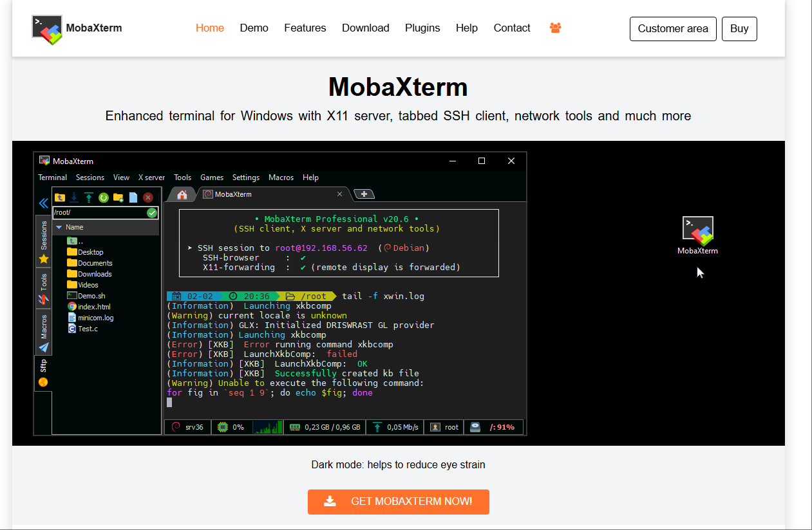

MobaXterm官网：[https://mobaxterm.mobatek.net/](https://mobaxterm.mobatek.net/)

MobaXterm 是一款功能强大的远程访问终端工具，它将xshell和xftp的优点结合起来，适用于IT从业者和Linux系统管理员。

MobaXterm 支持SSH协议，提供颜色丰富的代码高亮显示，界面设计友好，易用性高。内置FTP客户端功能，提供稳定快速的文件传输服务。此外，MobaXterm还支持多种协议和安全认证机制，是远程终端操作和文件管理的理想选择。

MobaXterm主要功能如下所示
- 支持各种连接 SSH，X11，RDP，VNC，FTP，MOSH
- 支持 Unix 命令(bash，ls，cat，sed，grep，awk，rsync，…)
- 连接 SSH 终端后支持 SFTP 传输文件
- 各种丰富的插件(git/dig/aria2…)
- 可运行 Windows 或软件

[文章参考链接](https://blog.csdn.net/erciguihua/article/details/144258751)

## MobaXterm 下载并安装

访问MobaXterm官网，下载MobaXterm安装包。

MobaXterm 分免费开源版和收费专业版。免费开源版又分绿色免安装版(解压即用)和安装版(需要一步步安装)。

可以下载免费的免安装版本或安装版本。
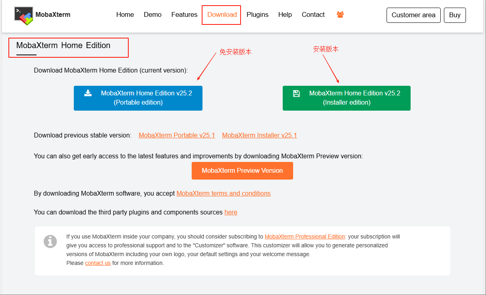

安装完之后，软件运行的界面如下所示
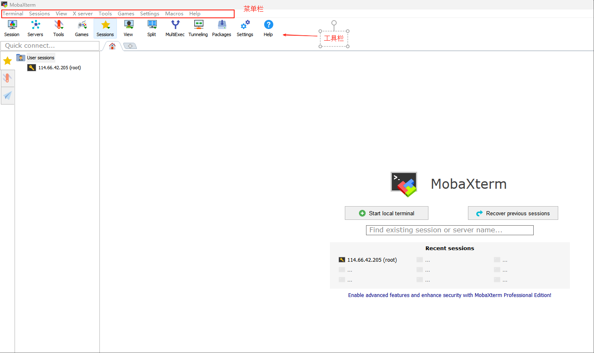

## 开启MobaXterm的右键粘贴功能

在很多终端工具里，都有"鼠标左键划选复制文件，右键粘贴文本"的功能。但在MobaXterm中右键粘贴功能默认不打开，需要手动打开。

在菜单栏点击 「settings」 –> 「Configuration」，在弹出的对话框中选择 「terminal」，再将 「paste using right-click」 打上对勾即可。

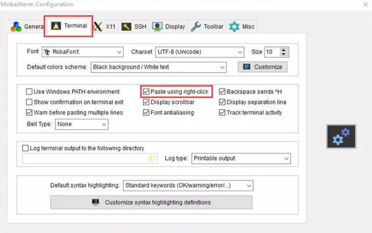

## 各种工具集

工具间集包括了系统工具、办公工具、网络工具。

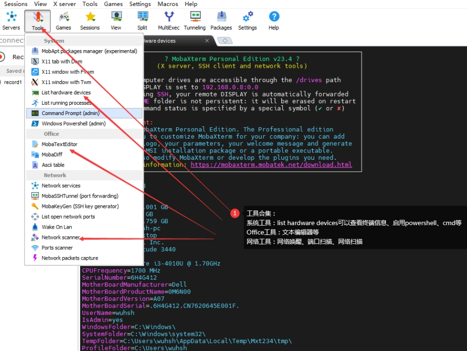

## 分屏功能

支持分屏2个窗口或者四个窗口。可以是左右分或者上下分。

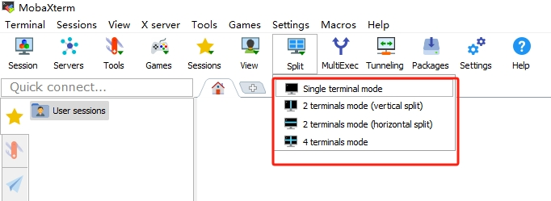

## 查看服务器状态信息

在此处可以查询服务器的各个状态信息
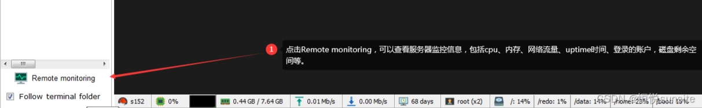

## MultiExec多屏同时执行功能

使用MultiExec功能可以同时在多个服务器终端中执行同一个命令。

例如打开服务器A的终端和服务器B的终端，然后使用MultiExec功能。即可在两个终端中同时执行同一个命令。

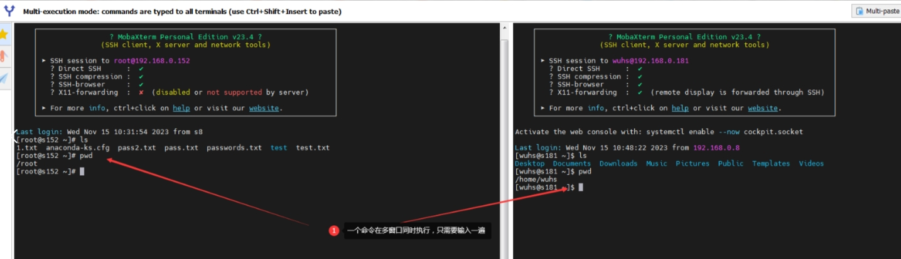

## SSHTunneling功能

SSHTunneling功能实际上就是自动登录跳板机环境。

比如我们需要登录服务器A，但是根据安全管理要求，必须先登录跳板机B，通过跳板机B才可以登录A。这个时候我们就可以配置一条SSHTunneling通道。

如下图所示，配置好通道之后，启动隧道，这个时候就会监听1080端口，新建session 127.0.0.1:1080,实际上登录的服务器是s152。免费版有限制，只可以配置2条隧道。

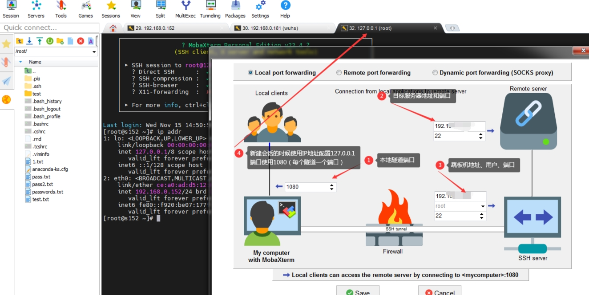

## MobaXterm 文本编辑器

在终端环境中可以直接使用文本编辑器 “MobaTextEditor” 编辑远程服务器的文件。

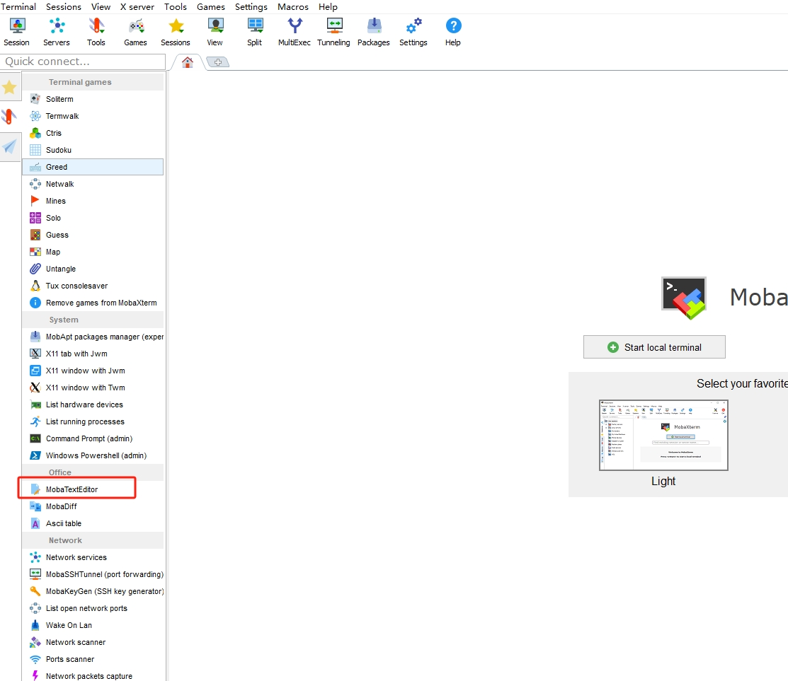

## 使用SSH终端

点击菜单栏 「sessions」 –> 「new session」，在「session setting」对话框中填写SSH连接信息,填写完成后点击「OK」按钮。

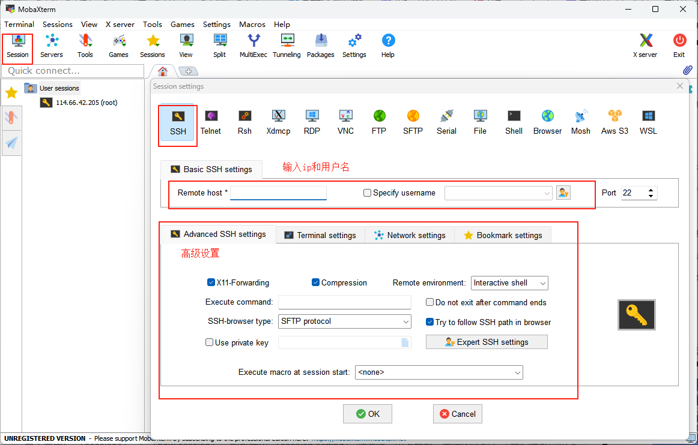

第一次连接SSH终端时，会弹出一个对话框，要求设置master password，即打开会话的密码。

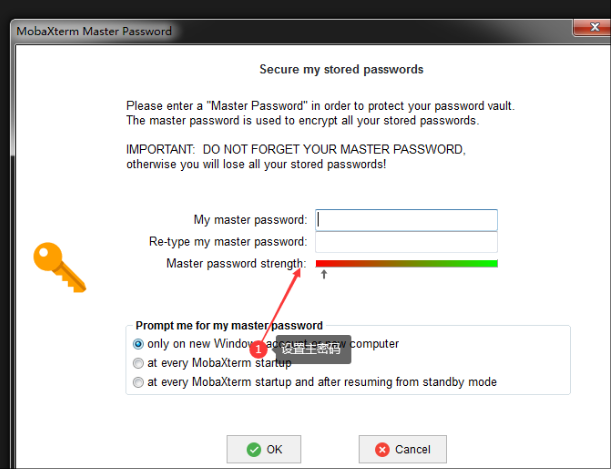

输入服务器的密码，成功登录服务器后，即可在MobaXterm中使用SSH终端。界面如下所示。

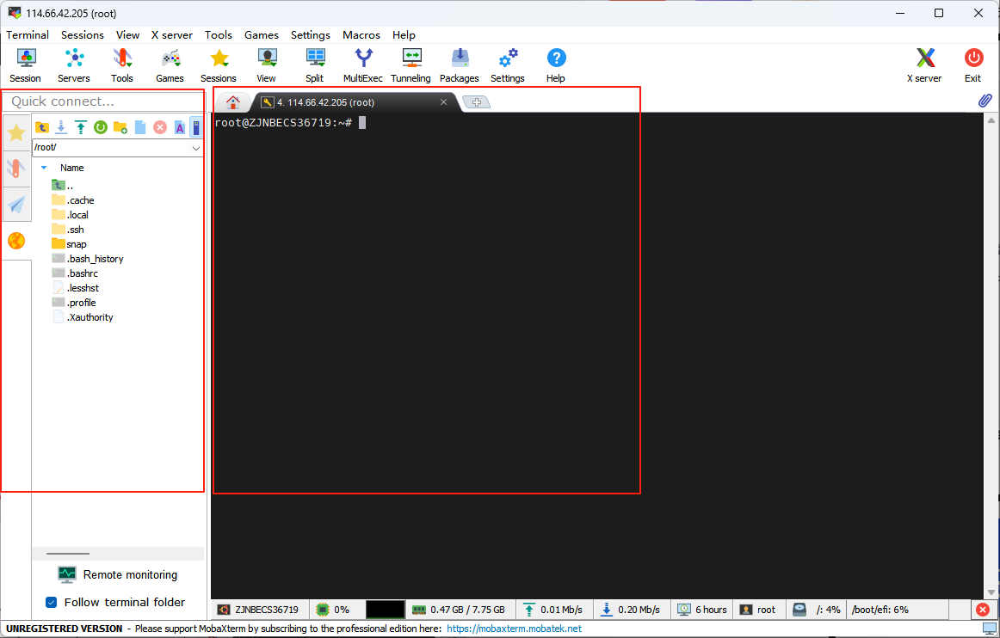

界面主要分两块，左边的是服务器的文件，右边是服务器的终端。

## 使用SFTP服务操控文件

当我们使用SSH服务远程登录服务器后，会默认开启一个SFTP窗口，我们可以在SFTP窗口进行上传、下载文件。也可以执行创建文件夹、删除等操作。

如图所示左边的就是SFTP窗口。

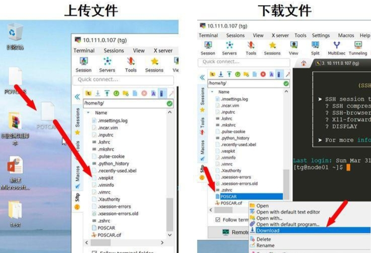

## 使用telnet远程登录

交换机、路由器等设备常用telnet远程管理方式，MobaXterm也可以满足要求。

点击菜单栏 「sessions」 –> 「new session」，在「session setting」对话框中填写telnet连接信息,填写完成后点击「OK」按钮。

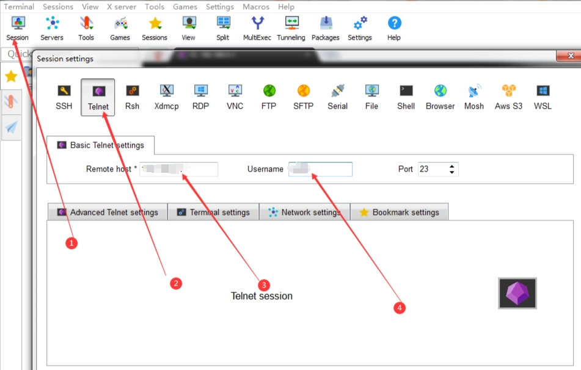

telnet登录后就是正常的shell操作窗口,正常使用即可。

## 使用RDP远程登陆其他windows服务器

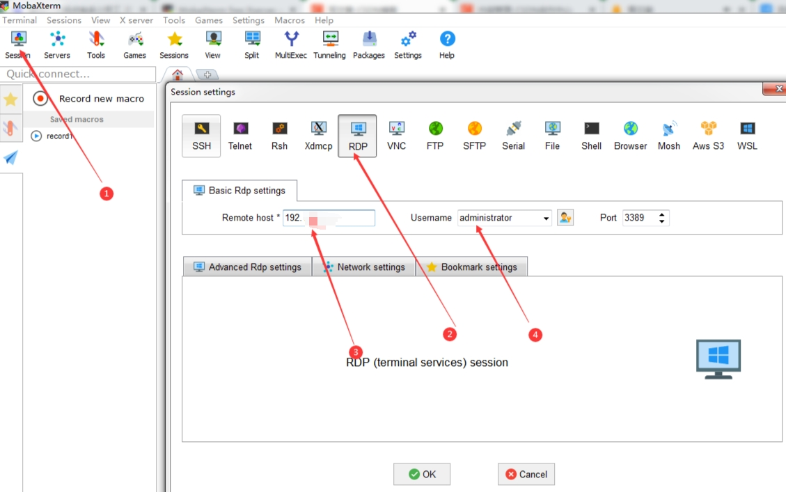

## 宏指令功能

MobaXterm的宏指令功能是一项强大的自动化工具。它允许用户录制、编辑和执行一系列预定义的命令和操作。这一功能特别适合重复性的任务，能够显著提高工作效率，减少手动输入错误。

> 宏指令功能在以下场景中特别有用

1. **多服务器初始化配置**：录制一套初始化服务器的命令，如更新系统、安装常用软件等，然后在多台服务器上执行
2. **日常维护任务**：将日常需要执行的维护命令（如日志清理、服务状态检查等）录制为宏指令
3. **批量数据处理**：录制数据查询、处理和导出的命令序列

### 宏指令的创建与录制

创建宏指令的过程非常直观，主要通过以下步骤完成：

1. 点击菜单栏中的「Macros」→「Start macro recording」开始录制宏指令
2. 在终端中执行您需要自动化的一系列命令和操作
3. 完成操作后，点击菜单栏中的「Macros」→「Stop macro recording」结束录制
4. 在弹出的对话框中，为宏指令命名并保存。
5. 录制好的宏指令，可以在任何的会话窗口点击执行。因此可以把日常巡检命令录制为宏指令，点击后批量执行。

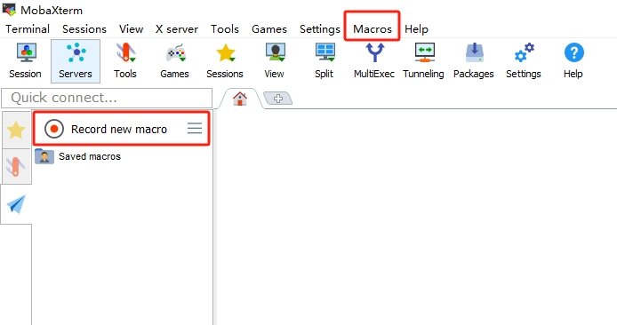

